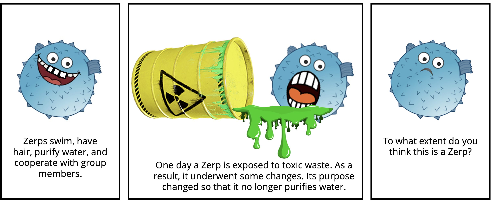

# Teleological properties

This repository contains the experiments, data, analyses, and figures for the paper "Teleological properties matter more for categorization," 


__Contents__:
- [Introduction](#Introduction)
- [Repository structure](#Repository-structure)

## Introduction



<br clear="left" />
<br clear="right" />


What kinds of properties matter most in categorization? Does it matter whether properties are attributed in generic (e.g., "Bees are striped'') or specific (e.g., "This bee is striped'') statements? Because a standard view about the role of generics in categorization is that we categorize things by considering their essential properties, and generics are the central vehicle by which beliefs about essences are transmitted, we focus on classic tests of essentialist thinking --  transformation, induction and offspring tasks -- to address what kinds of properties matter in categorization and whether it matters whether they feature in generic or specific statements. In Experiment 1, participants categorized properties as being either behavioral, biological, social, or teleological. In Experiment 2, we used the top four properties from each group to describe a generic noun or a specific individual. Transforming a teleological property had a stronger effect on categorization judgments compared to the other types of properties. Teleological properties also mattered more when categorizing novel creatures (Experiment 3) or offspring (Experiment 4). While for Experiments 2 and 3, it made no difference whether properties were attributed in generic or specific form, Experiment 4 showed stronger effects for generic statements. Overall, our findings suggest that teleological properties play a privileged role in how people categorize and essentialize, and that whether these properties are introduced in generic or specific form might matter less.


## Repository structure

```

├── code
│   ├── R
│   │   ├── cache
│   ├── experiments
│   │   ├── experiment1
│   │   ├── experiment2
│   │   ├── experiment3
│   │   └── experiment4
│   └── python
├── data
│   ├── experiment1
│   ├── experiment2
│   ├── experiment3
│   └── experiment4
├── docs
│   ├── experiment2
│   ├── experiment3
│   ├── experiment4
└── figures
    ├── experiment1
    ├── experiment2
    ├── experiment3
    ├── experiment4


```

- `code/` contains all the code for the experiments, analyzing data and generating figures.
  - `experiments` contains code for each experiment that was run. Pre-registrations for all experiments are linked below.
    	- `experiment1` ([pre-registration](https://osf.io/4dux6/?view_only=ace54f88f0434856b9ac02cfe6df651b)) was run in psiturk 
	- `experiment2` ([pre-registration](https://osf.io/a92nj/?view_only=d64cc77d0de94414b3a20a6abad29724)), `experiment3` ([pre-registration](https://osf.io/zdegq/?view_only=4d8c2abdfc4e4e33a8de287fa627b6b2)) `experiment4` ([pre-registration](https://osf.io/2a3x5/?view_only=2da045cac79b4b648fae27b3e3f63039))and were run in jsPsych. These are copied in `docs` below where they can be rendered in your browser.
  - `python` contains scripts that were used to get the probabilities of sentence completions for properties used in experiment 2.
  - `R` contains the analysis scripts that were used to analyze data and generate figures
     (view a rendered file [here](https://cicl-stanford.github.io/teleological_properties/)).
- `data/` contains anonymized data from all experiments:
  - `experiment1` contains `experiment1.db` which includes trial and demographic data. 
  - `experiment2` contains `experiment2.csv` which includes the trial data and `experiment2_demographics.csv` which includes demographic data. The remaining files are for getting the probabilities of sentence completions from large language models for the properties used in experiment 2. 
  - `experiment3` contains `experiment3.csv` which includes the trial data for experiment 3 while `experiment3_demographics.csv` contains the demographic data.
  - `experiment4` contains `experiment4.csv` which includes the trial data for experiment 3 while `experiment4_demographics.csv` contains the demographic data.
- `docs/` contains all the experiment code for `experiment2`, `experiment3` and `experiment4`. You can preview the experiments below:
    - Experiment 2 - [Generic condition](https://davdrose.github.io/teleology_submission/experiment2/index.html?condition=1),
      [Specific condition](https://davdrose.github.io/teleology_submission/experiment2/index.html?condition=2)
    - Experiment 3 - [Generic condition](https://davdrose.github.io/teleology_submission/experiment3/index.html?condition=1),
      [Specific condition](https://davdrose.github.io/teleology_submission/experiment3/index.html?condition=2)
    - Experiment 4 - [Generic condition](https://davdrose.github.io/teleology_submission/experiment4/index.html?condition=1),
      [Specific condition](https://davdrose.github.io/teleology_submission/experiment4/index.html?condition=2)
- `figures/` contains all the figures from the paper (generated using the script in `code/R/`). 

